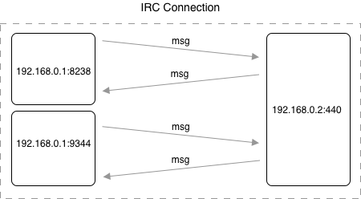

# IRC-Zeek-package
Zeek Package that extracts features from IRC communication

## Installation
To install the package do the following in the package directory:
    $ git clone git@github.com:stratosphereips/IRC-Zeek-package.git
    $ cd IRC-Zeek-package
    $ zkg install .

## Run
To extract the IRC features on selected pcap file that contains IRC, the only thing that you need to do is:

    zeek -r file.pcap irc_feature_extractor

output will be redirected `irc_features.log` file in zeek log format.

## Description
To be able to use our data, we separated the communication into the connections between source IP, destination IP and destination port (hereinafter IRC connection)(see Figure below). The source port is neglected because we wanted to to merge communication that was splitted to more TCP connections. When the TCP connection is made, the source port is randomly generated from the unregistered port range and thus we needed to neglect the source port to match the IRC connection with the same source IP, destination IP and destination port. 
IRC connection consists of informations that are needed.

## Extracted Features
The feature selection is made manually to provide a good means of characterizing malicious communication. Features were computed for each IRC connection. Here is a final list of features that we used in our models.
### Total Packet Size
Total data packets' size in bytes.
### Session Duration
Duration of IRC connection in milliseconds.
### Number of Messages
Total number of messages in IRC connection.
### Number of Source Ports
Since the source port is neglected in unifying communication into sessions, the source address can use different port per TCP connection when the port is randlomly chosen. We suppose that artificial user could have higher number of source ports than the real user since the number of connections of the artificial user could be higher than the number of connections of the real user.
### Message Periodicity
To compute message periodicity, we firstly compute time differences between every message. On this computed sequence of numbers, we apply a fast Fourier transform (FFT). Fast Fourier transform is an effective algorithm for computing discrete Fourier transform, which we are using to express time sequence as a sum of periodic components and for recovering signal from those components. The output of FFT is a sequence of numbers with the same length as the input. The higher the number on a given position of the output is, the bigger the amplitude on the given position is, and thus it has a more significant influence on the periodicity of the data. The position of the largest element in the FFT's output represents the length of the period which occurrence is the most probable from all other periods.

To compute the quality of the period, we split the data by the length of a period. Then we compute the normalised mean squared error (NMSE) that returns us the resulting number in the interval between 0 and 1 where 1 represents the perfectly periodic messages, and 0 represents not periodic messages at all.

### Message Word Entropy
To take into account whether the user is sending the same message multiple times in a row, or whether the message contains limited number of words, we compute word entropy across all messages in IRC connection. For computation of word entropy we are using formula below,

where n represents number of words and p_i represents the probability that word $i$ is used among all other words.
### Username Special Characters Mean
Average usage of non-alphabetic characters in username.
### Message Special Characters Mean
Average usage of non-alphabetic character across all messages in IRC connection.
